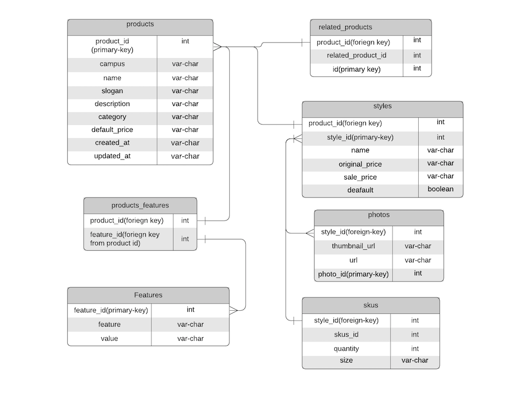

# overview-api for runway-inconceivable

Back-end system design

# Contributors

[Dani Tian](https://github.com/danitian "Dani Tian")

[Sam Sparks](https://github.com/sgsparks "Sam Sparks")

[Adam Whitman](https://github.com/emagdaeh "Adam Whitman")

# Introduction

Runway-Inconceivable is a back-end design for a front-end legacy codebase for an e-commerce website focused on clothing and apparel.  The team was comprised of three engineers including myself, and I was responsible for building out the server and database for the ratings and reviews section of the website with the other two engineers handling the product overview and the questions and answers section.  We deployed on AWS EC2 instances and scaled to handle typical web traffic.

# Tech Stack

<ul>
<li>Express</li>
<li>Axios</li>
<li>PostgreSQL</li>
<li>PG</li>
<li>Docker</li>
<li>NGINX</li>
<li>Loader.IO</li>
<li>Artillery</li>
<li>New Relic</li>
</ul>

# Technical Challenges

I was faced with handling an interesting challenge of writing a highly complex PostgreSQL query that involved an object with three layers of nesting and each level having unique identifiers to manage as well as aggragation of scores within the third layer of nesting.  Solving it was an adventure and a lot of fun!

Scaling was also a fun challenge of making small tweaks and testing each variable changed.  I had to be efficient in my testing to get all the data I needed and make changes before throttling occurred in the AWS free tier limit of requests per day.

# User Stories

<ul>
<li>As a user, I expect to be able to make an HTTP request and receive data from the database with less than 100ms delay</li>
<li>As a company, I expect my website to be able to handle normal daily web traffic with less then 2000ms delay and less than 1% error rate</li>
<li>As a user, I expect to have data persistence when I write a review and upload pictures</li>
</ul>

# Minimum Viable Product (MVP)

The MVP expects that a user should be able to interact with the legacy code front-end application with a fully functional back-end including data persistence.  The back end should also be able to scale to handle a minimum of 400 requests per second on each section of the web app, have a less than 2000ms latency in response, and have less than 1% error rate.

# Stetch Goals and Additional Features

<ul>
<li>Optimize to handling 1000rps, less than 500ms latency, and less than 1% error rate</li>
</ul>

 

# Future Enhancements

Future enhancements would include returning to the serve code and optimizing queries as well as adding additional instances for the database as the current scaling appears to be bottlenecked at the database indicated by New Relic data.